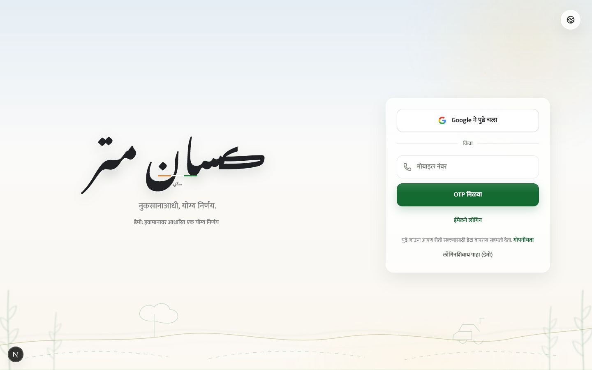
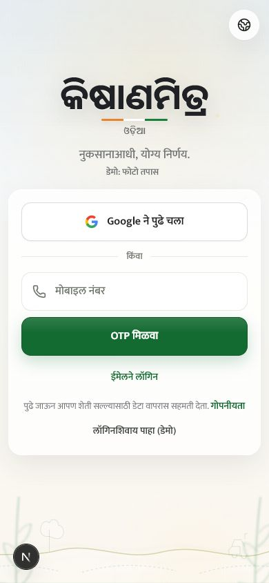
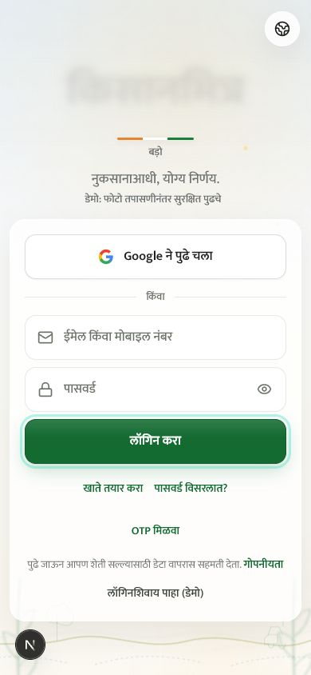
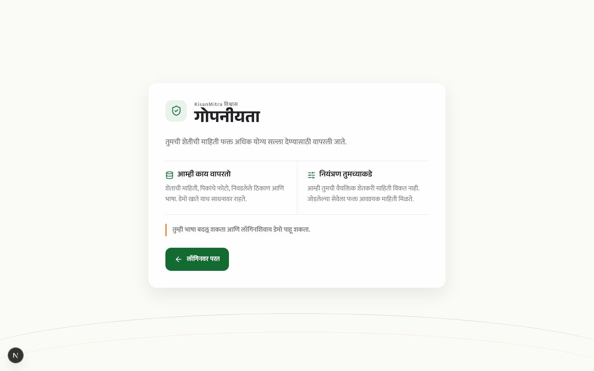
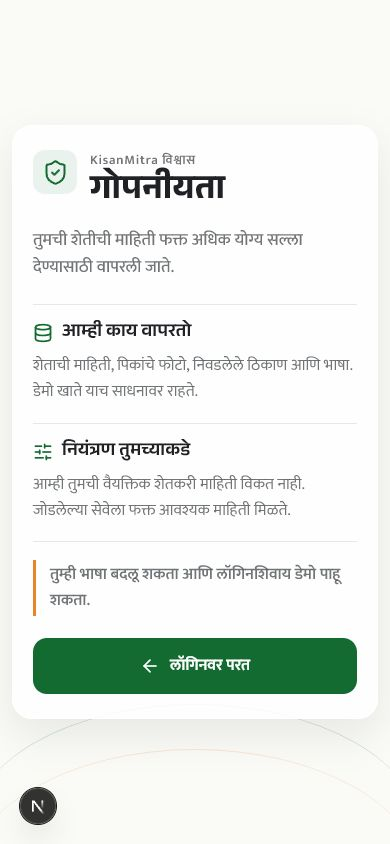

# V12 Phase 1 Walkthrough

## Scope

This phase implements the v12 foundations and the direct `Morning Light` login at `/`. It also brings the linked Privacy route into the same three-language system. Dashboard and core-screen redesign work remains behind the next phase approval gate.

## Primary Flow

1. Open `/`: Hindi paints immediately unless a durable language preference exists.
2. Approximate location selects Marathi for Maharashtra/Goa, Hindi for the rest of India, and English abroad; browser language is the timeout fallback.
3. The farmer can override this from the globe menu containing only Marathi, Hindi, and English. The server cookie makes that choice survive restricted browser storage and route changes.
4. The 22-script KisanMitra brand wordmark cycles independently from the single active application language; Urdu is intentionally excluded.
5. Continue with Google, request an OTP, expand email login, or enter the seeded demo.
6. Privacy opens in the selected application language and returns to login without losing that choice.

## Named States

### Login, Desktop, 1440x900

Verified: exact 60/40 split, 400px auth card, one mounted `h1`, no page overflow, Mukta body font, script-aware wordmark font, and four-plane pointer parallax response.

### Login, Mobile, 390x844

Verified: zero horizontal or vertical page overflow, no clipped controls, one mounted wordmark, and dynamic font fitting for wide writing systems.

### Expanded Email Login, Mobile, 390x844

Verified: both 56px fields, password visibility control, primary action, account links, consent, and demo action remain inside one viewport.

### Privacy, Desktop and Mobile

Verified: Marathi cookie preference, Anek/Mukta typography, no raw palette values, 56px return action, no clipped controls, and no text below 13px.

## Automated Gates

- `npm run lint`: pass; the v12 design guard runs inside lint. Fifteen pre-existing warnings remain outside this phase.
- `npm run typecheck`: pass.
- `npm test`: 11 files and 60 tests pass.
- `npm run build`: pass; 24 routes generated and the root Open Graph image prerendered.
- `git diff --check`: pass.

## Foundation Guard

`npm run check:design` currently governs 21 v12 files. It fails on raw hex colors outside `design-tokens.css`, legacy Inter/DM font names, old obsidian/atmblue tokens, or missing required palette tokens.
